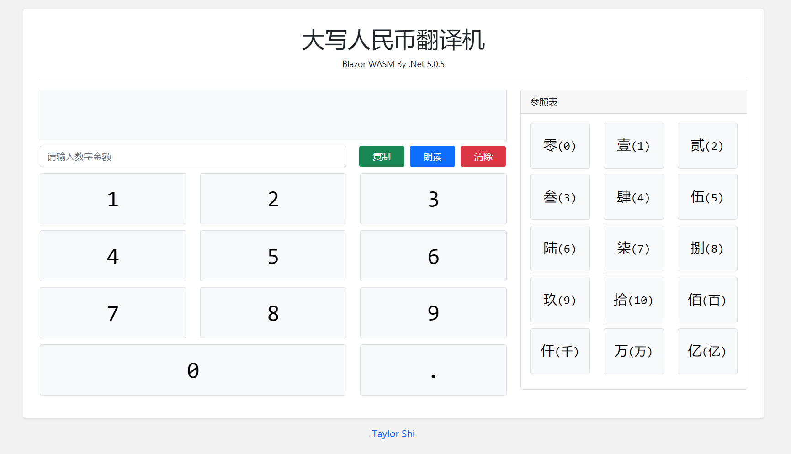

# 大写人民币翻译机

## 简介

大写人民币翻译机，是一款结合`Blazor`和`WebAssembly`技术联合打造并且运行在`.Net 5.0`运行时的数字转大写人民币应用，适用于差旅报销时填写报销单需要将阿拉伯数字报销金额翻译成大写人民币金额的场景。

## 引用

该项目为一个演示项目，旨在实践和练习Blazor技术，其原版来自阿迪的[RMBCapitalization-Blazor](https://github.com/EdiWang/RMBCapitalization-Blazor)和技术文章[《Blazor WASM 实现人民币大写转换器》](https://edi.wang/post/2021/3/1/blazor-wasm-rmb-capitalize)

## 运行效果

* [https://rmbcc.ledesign.org](https://rmbcc.ledesign.org)

